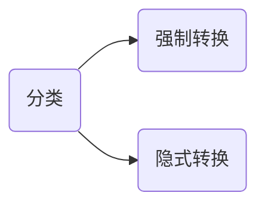
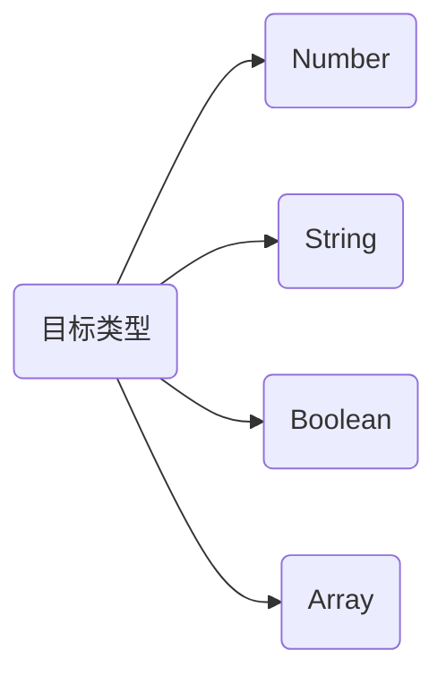
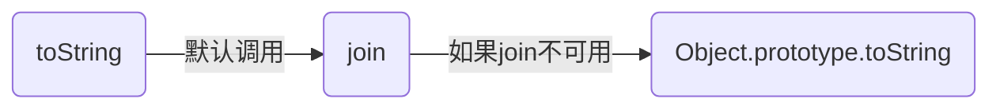
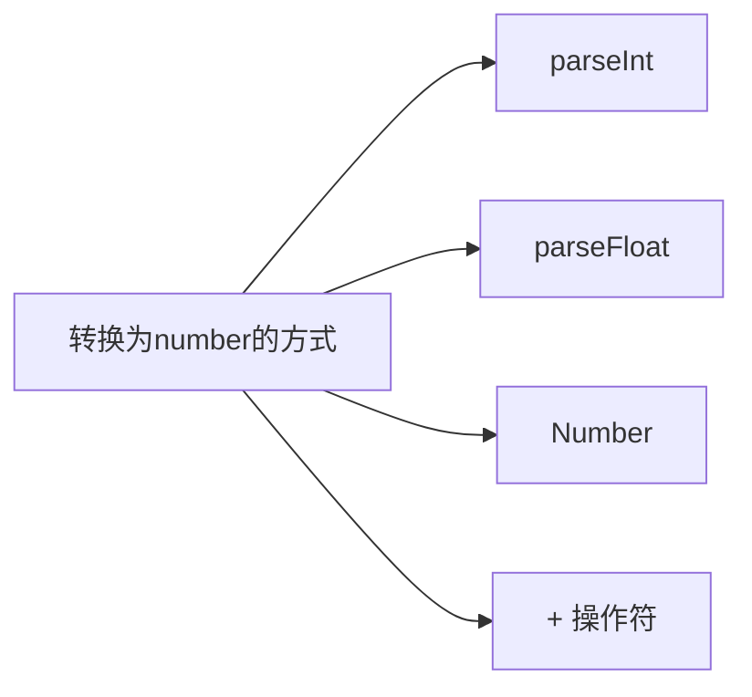
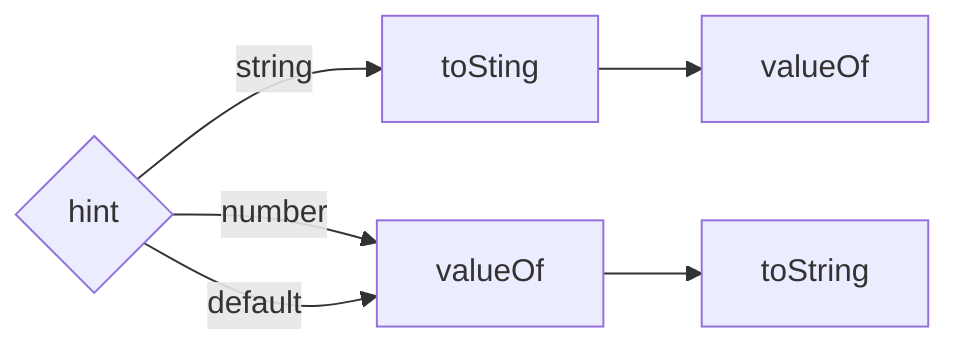

# 数据类型

共 8 种数据类型，6 种常用 + BigInt + Object。以下是原始类型的描述，反过来就是引用类型 Object。

> In JavaScript, a primitive (primitive value, primitive data type) is data that is not an object and has no methods or properties.

## 类型检测

> 如果你手里有一把锤子，所有东西看上去都像钉子

考虑的思路是先明确要判断什么类型，然后再是选择工具。然后在工具选择上，原则就是怎么准确又简单，就怎么来。

| 目标类型 | 判断方式      |
| :------: | ------------- |
| 基础类型 | typeof        |
|   函数   | typeof        |
|   数组   | Array.isArray |
|   null   | ===           |
| 实例关系 | instanceof    |

其他情况可以使用 Object.prototype.toString.call，不应该使用的 constructor 就不说了。

:::note 🤔
我的方案是写一个统一的类型判断的小工具，不再每次需要的时候再各自自定义实现。
一次做功，长久收益。
:::

## 类型转换

说到类型转换，都免不了提到**显式转换/强制转换** 和 **隐式转换** 这两种划分。



显隐是相对的，如果是从字面意义的“明显程度“来做区分，那每个人理解深度不一样，无法形成标准。

显隐，应该是从表达式的目标和实现区分

- 强制转换：目标上 **是** 类型转换，实现上 **明确调用** 转换方法或使用类型转换的操作符
- 隐式转换：目标上 **并不是** 做转换，实现上 **并没有调用** 特定的转换方法或类型转换的操作符

显隐的区分，更多只是为了帮助我们理解那些特殊的情况，在使用类型转换时，我们思考的顺序如下所示


先根据目标类型划分，再选择转换的实现方式，这是梳理类型转换相关知识的较好的方式。



类型转换，日常使用的基本上是转换到 Number, String, Array, Boolean 这几种情况。

:::note
当我们说到类型转换时，可以分成两个问题：

- 从 A 类型转换到 B 类型，应该使用怎样的方式
- 从 A 类型转换到 B 类型，采用的转换方式会经历怎么的过程，得到怎样的结果

相对来说，第二个可能不是那么明显的，有时经过会有些曲折。
:::

## toString {#toString}

### Primitive

基础类型转换为字符串，最简单的方式是与一个空字符串`''`相加，基本上就是原来的内容转换成字符串形式。

```js
null + ""; // 'null'
undefined + ""; // 'undefined'
true + ""; // 'true'
1 + ""; // '1'
```

也有一些特殊情况，但不复杂

```js
0.0000000001 + ""; // '1e-10' 数字特别大或者特别小会变成指数形式
Symbol("foo").toString(); // 'Symbol(foo)'
```

其中 Symbol 的字符串更多只是便于区分，日常开发中也不需要将其转换为字符串。

### Array

数组转字符串

```js
[1, 2, 3].toString(); // '1,2,3'
```

默认情况下，`toString` 尝试调用 `join`，join 的默认拼接字符是 `,`

```js title="验证 toString 方法的调用过程"
const arr = [1, 2, 3];
arr.join = "wow";
arr.toString(); // [object Array]

arr.join = function () {
  return "myy";
};
arr.toString(); // myy

arr.toString = function () {
  return "esmyy";
};
arr.toString(); // esmyy
```

调用关系描述如下

> The toString method of arrays calls join() internally, which joins the array and returns one string containing each array element separated by commas. If the join method is unavailable or is not a function, Object.prototype.toString is used instead, returning [object Array].



## toNumber

转换为 Number 类型的场景，大多数的场景是从 String 转换为 Number，主要有 parseInt、parseFloat、Number 3 种方式。



JS 中并没有整数和浮点数的不同类型，都是 Number，不同的转换方式，只是转换处理过程的不一样，从而导致的结果的不一样。

### parseInt

```js
parseInt(str, radix);
```

由于参数的不同，parseInt 的处理过程，有非常多的情况，靠单纯的记忆是很容易忘记的。
我将这个流程，拆分成两个子步骤

1. 第一个参数如果不是字符串，会尝试转换为字符串，如何转换可参考上面的 [toString](#toString)
2. 字符串从做到右截取符合条件的字符，然后再做转换，参考 [MDN parseInt](https://developer.mozilla.org/en-US/docs/Web/JavaScript/Reference/Global_Objects/parseInt) 的说明

关于第 2 点，有以下特点

- radix 介于 [2-36]
- 不提供第二个参数，如果是`/^0x/i.test(str.trim())`则为 16 进制其他为 10
- 并不识别 `0b`，不会当做 2 进制
- 前面的空格, 0 会被忽略

在第 1 步确保得到一个字符串后，parseInt 的结果是 NaN 还是一个整数，取决于能否满足 **第一个有效字符是合法字符** 的条件

```js
// 并不完全准确，大概逻辑如下
const chars = "0123456789abcdefghijklmnopqrstuvwxyz";
const validate = function (str: string, radix?: number) {
  if (radix && (radix < 2 || radix > 36)) {
    return false;
  }

  let computedRadix = 10;
  if (!radix && /^\s*0x/i.test(str)) {
    computedRadix = 16;
  }

  const validChars = chars.slice(0, computedRadix);
  const validReg = new RegExp(`^\s*[+-]?(0x)?[` + validChars + "]+", "i");
  return validReg.test(str);
};
```

在上述代码中，正则表达式中 **第一个有效字符** 的匹配是根据参数动态计算得到的，可以动态地判断是否能够得到一个数字。
这样对于 parseInt 的处理，按照下面这个流程，就能够做到比较简单，也比较准确地判断了


```js
// 非字符串值的情况
parseInt(null);
parseInt(undefined);
parseInt(null, 36);
parseInt(true);
```

匹配规则上，如果第一个非空字符，不符合 radix 要求的合法字符，则返回 NaN

```js
parseInt("0xe"); // 15
parseInt("00xe"); // 0
parseInt("1e2"); // 1 不识别指数形式

parseInt(undefined); // NaN
parseInt(null, 36); // 1112745，null先转换为字符'null'，都是36进制的合法字符

parseInt("15,123", 10); // 15, 有效字符后出现非有效字符，会截取，而不是NaN
parseInt("FXX123", 16); // 15
```

### parseFloat

```js
parseFloat(str);
```

parseFloat 的截取规则与 parseInt 差不多，都是从左到右截取符合要求的部分，只是”要求“有所变化，特别之处在于它能够

- 识别一些特殊值
- 识别指数形式
- 合法字符多了指数的`e`和小数的`.`

```js
// 识别一些特殊值
parseFloat("Infinity"); // Infinity
parseFloat("-Infinity"); // -Infinity

// 不支持16 进制的识别
parseFloat("FF2"); // NaN
parseFloat("0xFF2"); // 0

// 一样会截取，不会因为后面有不符合的就NaN
parseFloat("3.14some non-digit characters");

parseInt("1e2"); // 100 识别指数形式
```

:::note
Number.parseInt 和 Number.parseFloat 是两个 parse 函数的模块化版本，处理过程是一样的，这也是 JS 进步的体现。
:::

### Number()

相对 Number() 而言，parseXxx 指针对于字符串而言的，判断结果是 Number 还是 NaN 的逻辑更容易理解和记忆。
而 `Number()` 就比较零散，没有能够层层推进的判断逻辑，更多是靠列举，参考[Number coercion](https://developer.mozilla.org/en-US/docs/Web/JavaScript/Reference/Global_Objects/Number#number_coercion)。

:::tips
`+`符合转换和 Number()的处理过程一样。
:::

## 特殊值检测

```js
// null
val === null;

// undefined
val === void 0;
val === undefined;
typeof val === "undefined";

// isNaN
val !== val;
isNaN(val) && typeof val === "number";
Number.isNaN(val);
```

## 装箱过程

原始类型中，有些类型比较特殊

<Mindmap
  chart={`
  mindmap
    root((包装对象))
      Number
      String
      Boolean
`}
/>

这几个类型各自对应有一个同名函数，作为普通函数调用，返回一个原始值，这与直接使用字面量的方式定义一致。
作为构造函数调用时返回一个对象，这个对象称作包装对象。

```js
const str1 = String("esmyy");
typeof str1; // string

const str2 = new String("esmyy");
typeof str2; // object
```

包装对象的“包装”是针对于原始类型的，就像是给原始类型套上了属性，方法，变成了一个对象。当然，我们一般不会，也不应该调用原始类型的构造函数,
我们说到“包装对象”，更多是在解释访问原始类型变量的属性或方法时发生的”包装“过程，这个过程称做装箱。

> When properties are accessed on primitives, JavaScript auto-boxes the value into a wrapper object and accesses the property on that object instead.

```js
str1.includes("myy"); // true
```

原始类型没有属性和方法，但是当访问属性时，会临时做一个包装。

:::note 对比
程序员日常并不西装革履，但需要的时候也可以的。
有的原始类型并不具备包装方法，就像有些程序员平时看起来邋遢，特殊时候也...始终如一。
:::

## 拆箱转换

拆箱转换，就是对象转换为原始值的过程。在拆箱转换的过程中，内部会根据使用的场景，判断需要的是怎样的一个类型，这个类型称为 hint。hint 有 3 种情况



默认情况下，根据 hint 的不同，会按照以上示意的顺序尝试进行调用，需要注意的是，

- 如果得到一个原始值(注意，并不一定和 hint 类型一致)，则结束调用路径，返回

  ```js
  const obj = {
    toString() {
      return 1;
    },
    valueOf() {
      return 2;
    },
  };

  String(obj); // '1'
  Number(obj); // 2
  ```

- 如果返回的是引用类型(包括 Array 这些子类型)，则继续调用路径中的函数

  ```js
  const obj = {
    toString() {
      console.log("toString");
      return 1;
    },
    valueOf() {
      console.log("valueOf");
      return [];
    },
  };

  obj + 300; // 依次打印 valueOf toString 301
  ```

- 如果过程中某个”尝试调用的函数“不是 function，则跳过

  ```js
  const obj = {
    toString() {
      return 1;
    },
    valueOf: 'hahaha';
  };

  Number(obj); // 1
  ```

- 如果最终的函数调用返回的是引用类型，报`TypeError`

  ```js
  const obj = {
    toString() {
      console.log("toString");
      return [];
    },
    valueOf() {
      console.log("valueOf");
      return {};
    },
  };

  Number(obj);
  // valueOf
  // toString
  // Uncaught TypeError: Cannot convert object to primitive value
  ```

ES6 拓展了一个新的方法，支持自定义转换为原始值的过程

```js
const obj = {
  [Symbol.toPrimitive](hint) {
    // ...
  },
};
```

定义了自定义的转换方法后，不走默认逻辑，就跟`valueOf`和`toString`没啥关系了，但是同样的，如果返回的值不是一个 primitive，会报 TypeError。

:::tip 小结
拆箱转换过程中，hint 只影响了调用顺序，与实际返回值的类型无关。拆箱转换只是得到一个原始值，如果得到的值与 hint 不一致，是拆箱转换之后再类型转换，所以有时候也称做**先拆箱后转换**。

TODO： 要判断拆箱转换的结果，先要确定在不同的情况下 hint 是什么，这个如何确定
参考 [MDN Symbol.toPrimitive](https://developer.mozilla.org/en-US/docs/Web/JavaScript/Reference/Global_Objects/Symbol/toPrimitive)
[ECMA ToPrimitive](https://tc39.es/ecma262/#sec-toprimitive)
:::

<!-- 参考[JSON](#JSON) -->

<!-- ## BigInt -->
